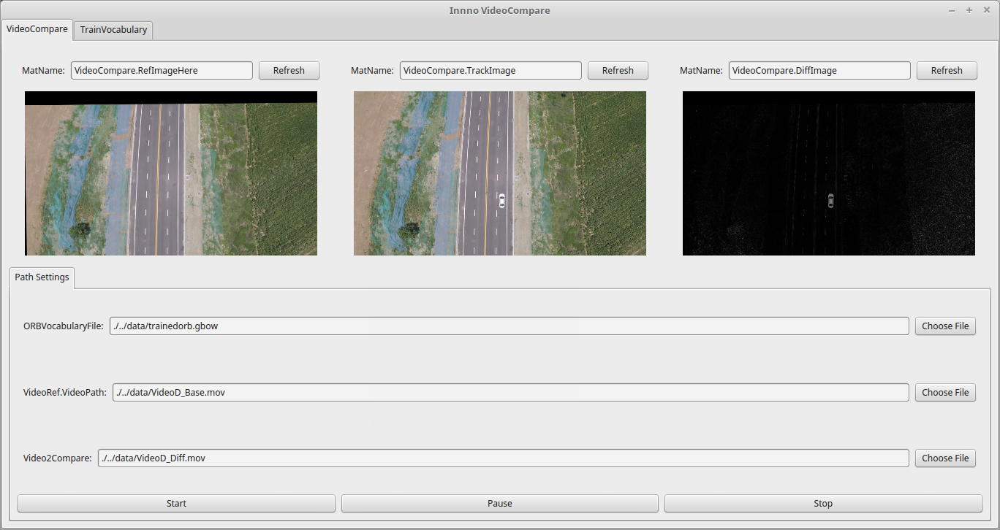

# VideoCompare

## Introduction

This application is designed to find the differences between two videos. The reference video is indexed with BoWs and so that the second video is able to find the best match keyframe from reference video very fast.

## Dependency 

PIL2: https://github.com/zdzhaoyong/PIL2

OpenCV2

## Demo

